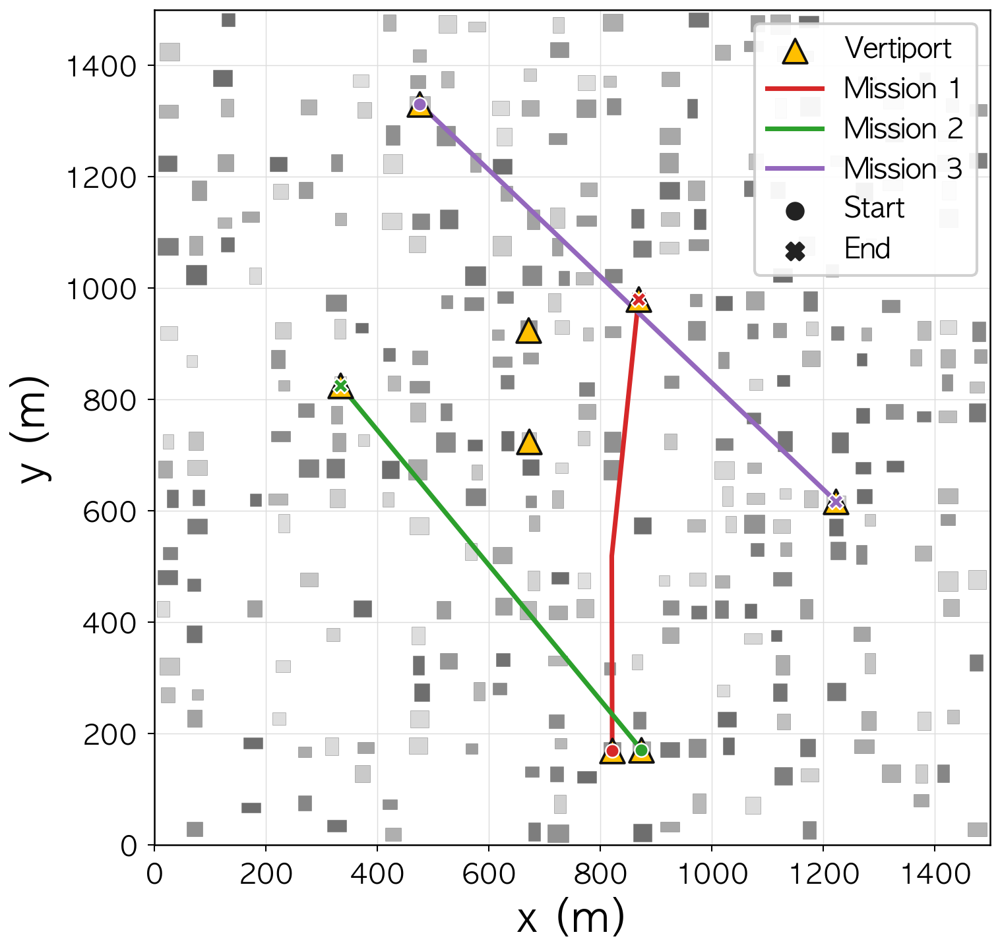
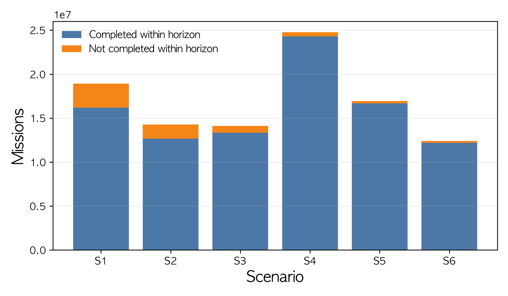
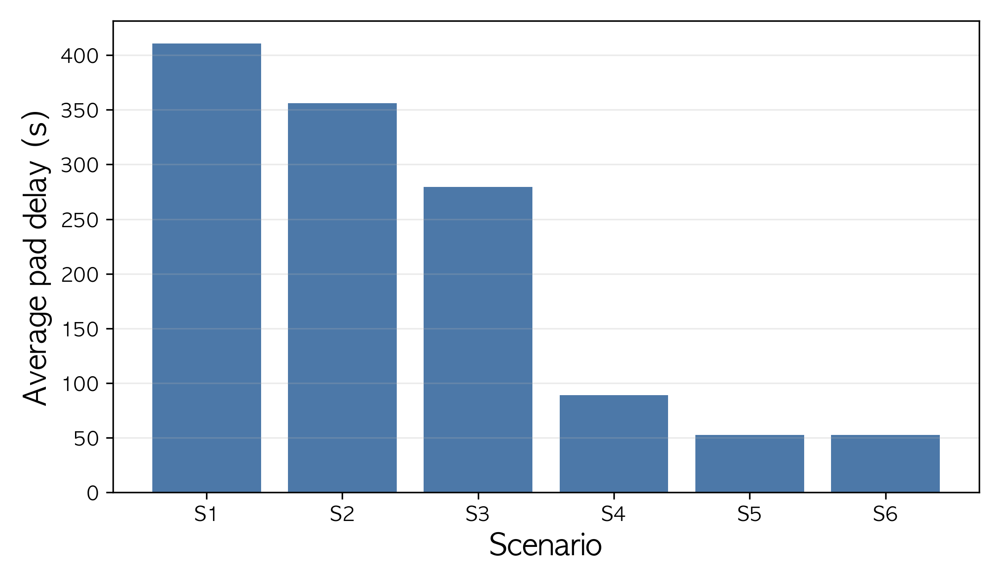
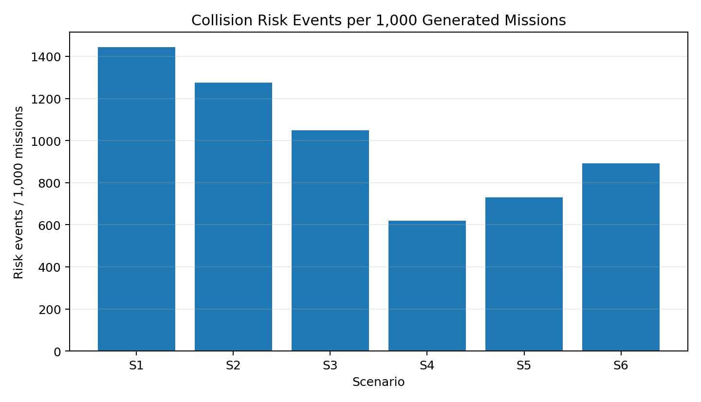
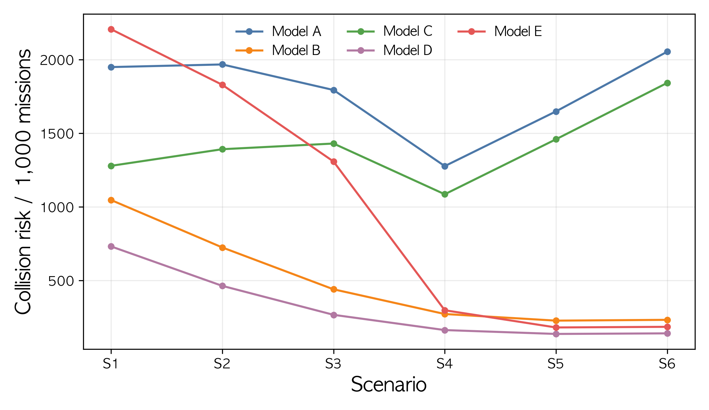
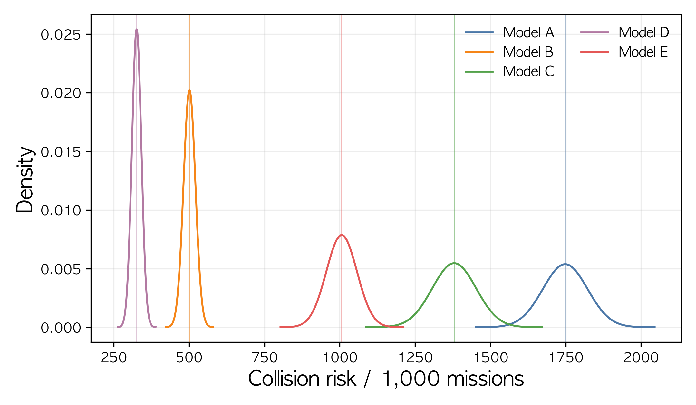
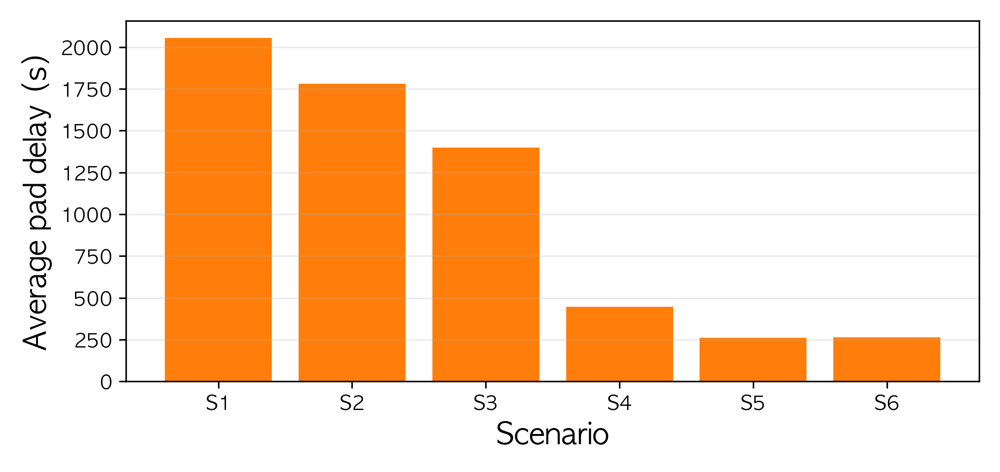

# eVTOL 이동성 모델 시뮬레이터 구현 및 충돌 회피 성능 분석

## English Title
Implementation of an eVTOL Mobility Model Simulator and Collision Avoidance Performance Analysis

## 요약
본 연구는 도심 격자 환경에서 eVTOL의 건물 회피, 비행체 간 충돌 회피, 버티포트 패드 점유 제약을 함께 분석하기 위한 파이썬 기반 이동성 모델 시뮬레이터를 제안한다. 시뮬레이터는 무작위 건물 배치와 옥상 버티포트, 연속 임무 생성, 상승-순항-하강 단계, 경유점 기반 건물 우회, 동일 시간대의 궤적 비교를 통한 비행체 간 회피, 패드 점유 대기 모델을 포함한다. 실험은 여섯 개의 확장 도시 시나리오와 다섯 개의 기능 조합 조건으로 구성되었으며, 전체 93,919회 반복 실행에서 101,432,520개의 임무가 생성되었다. 본 논문에서는 건물 회피와 비행체 간 회피를 함께 적용하여 정규화 충돌 위험률을 최대 93.1%까지 감소시켰다. 또한, 패드 점유 제약을 추가한 조건에서는 소형·고혼잡 시나리오에서 평균 패드 지연이 최대 46.9% 증가하고, 임무 완료율이 66.9% 감소하여, 버티포트 자원 제약이 누적 운항의 주요 병목으로 작용할 수 있음을 확인하였다.

## Abstract
This study proposes a Python-based eVTOL mobility model simulator for jointly analyzing building avoidance, inter-aircraft collision avoidance, and vertiport pad occupancy constraints in an urban grid environment. The simulator includes random building placement, rooftop vertiports, continuous mission generation, climb-cruise-descent phases, waypoint-based building detours, inter-aircraft avoidance through trajectory comparison within the same time period, and a pad occupancy waiting model. The experiment was composed of six expanded urban scenarios and five functional combination conditions, generating 101,432,520 missions over 93,919 repeated simulation runs. In this study, the combined application of building avoidance and inter-aircraft avoidance reduced the normalized collision-risk rate by up to 93.1%. In addition, under the condition with the pad occupancy constraint, the average pad delay increased by up to 46.9% and the mission completion rate decreased by 66.9% in small and highly congested scenarios, confirming that vertiport resource constraints can act as a major bottleneck in cumulative operations.

## Keywords
eVTOL, urban air mobility, mobility model, simulation, collision avoidance, vertiport

## I. 서론
도심항공교통(Urban Air Mobility, UAM)은 도심 내에서 3차원 공중교통체계를 활용하여 사람과 화물을 효율적으로 운송하기 위한 항공교통 생태계로 주목받고 있다[1]. UAM은 지상 교통망에 집중되어 있던 이동 수요의 일부를 공중 교통망으로 분산시킬 수 있다는 점에서, 인구 밀집 지역의 교통 혼잡 완화와 이동시간 단축을 위한 대안으로 논의되고 있다. 이러한 UAM을 실현하는 주요 기체 유형으로 전기 수직이착륙기(electric Vertical Take-Off and Landing, eVTOL)가 제시된다. eVTOL은 수직이착륙과 전기 추진 방식을 기반으로 도심 내 짧은 거리 이동에 적합한 운항 특성을 가질 수 있으나, 실제 도심 환경에서 안전하고 효율적으로 운항하기 위해서는 다양한 요소가 함께 고려되어야 한다.

도심 내 eVTOL 운항에는 건물 구조, 항로 설정, 버티포트의 위치와 운영, 기상 조건, 통신 인프라, 교통관리, 충돌 회피 전략 등이 복합적으로 작용한다[1, 2]. 예를 들어 고층 건물은 순항 경로와 고도 선택에 직접적인 제약이 될 수 있고, 다수의 기체가 동일한 시간대에 유사한 공역을 통과하는 경우 기체 간 분리 문제가 발생할 수 있다. 또한 버티포트는 출발지와 목적지 역할을 수행할 뿐 아니라, 이착륙 패드의 사용 가능 여부에 따라 임무 지연과 재투입 간격을 결정하는 운영 자원으로 작용한다. 따라서 eVTOL 이동성 모델은 단순히 출발지와 목적지를 직선으로 연결하는 경로 생성 문제가 아니라, 도시 공간 구조와 다중 기체 운항, 그리고 버티포트 자원 점유를 함께 고려하는 문제로 다뤄질 필요가 있다.

K-UAM 기술로드맵은 UAM 운용고도를 300-600 m로 제시하고, UAM 교통관리서비스 제공자(Provider of Service for UAM, PSU)가 항로 모니터링, 항공기 분리 관리, 버티포트 가용성, 악기상 정보 등을 다루는 구조를 설명한다[1]. 항로 모니터링은 비행 경로의 상태를 추적하여 잠재적인 충돌 위험을 사전에 파악하는 데 필요하고, 항공기 분리 관리는 서로 다른 기체 간 안전 간격을 유지하여 사고 가능성을 낮추는 데 기여한다. 버티포트 가용성 관리는 특정 시간대와 지역의 운항 수요를 처리하기 위한 이착륙 자원 배분과 관련되며, 악기상 정보의 전달은 비행 안전성을 높이는 데 중요한 요소이다. 선행연구는 충돌 회피, 장애물 회피, 기상, 통신, 버티포트 운영 등을 각각 다루어 왔으나, 본 연구는 이 중 건물 회피, 비행체 간 충돌 회피, 버티포트 패드 점유 제약을 하나의 경량 시뮬레이션 흐름 안에서 함께 관찰한다.

본 연구의 목적은 고충실도 항공기 동역학이나 실제 UAM 운항 전 과정을 재현하는 데 있지 않고, 도심 격자 환경에서 건물 회피, 비행체 간 충돌 회피, 버티포트 패드 점유 제약이 장시간 누적 운항 지표에 미치는 영향을 분석할 수 있는 재현 가능한 시뮬레이션 프레임워크를 제안하는 데 있다. 이를 바탕으로 본 연구가 검토하는 핵심 질문은 두 가지이다. 첫째, 건물 회피와 기체 간 회피를 함께 적용할 경우 기준 모델보다 충돌 위험이 얼마나 감소하는가이다. 둘째, 버티포트 패드 점유 제약을 추가하면 임무 완료율과 대기시간이 어떻게 변하는가이다.

본 연구의 기여점은 다음과 같다. 첫째, 통합 회피 모델 D는 모든 시나리오에서 정규화 충돌 위험을 낮추었으며, 최대 감소율도 93.1%로 나타났다. 이는 건물 회피와 기체 간 회피를 별도로 적용하는 것보다 두 기능을 함께 고려하는 구조가 위험 완화에 더 효과적임을 보여준다. 둘째, 건물 회피와 비행체 간 충돌 회피의 적용 여부를 조합한 기능 제거 기반 실험 조건을 구성하였다. 셋째, 통합 회피 조건에 버티포트 패드 점유 제약을 추가하여 충돌 위험 감소와 운영 병목이 서로 다른 지표로 나타날 수 있음을 분석하였다. 넷째, S1-S6 확장 도시 시나리오를 병렬 실행하여 장시간 누적 임무, 충돌 위험 이벤트, 버티포트 패드 지연을 표와 그래프로 분석하였다.

## II. 관련 연구
Pang et al.[3]은 다수 무인항공기(Unmanned Aerial Vehicle, UAV)의 4D 경로 충돌을 사전 탐지하고, 출발 지연, 속도 조정, 경로 재계획을 통해 충돌을 해소하는 적응형 최적화 프레임워크를 제안하였다. 이 연구는 6 km × 6 km × 120 m 공역과 100 m × 100 m × 30 m AirMatrix 블록을 사용하고, 최소 시간 분리 기준 30 s를 적용하였다. 본 연구는 해당 연구에서 제시한 다중 기체 경로 충돌과 시간 분리 개념을 단순 스케줄링 모델로 축소하여 반영하였다.

Park[4]은 다중 UAV를 구로 모델링하고, 직선 경로와 일정 속도 조건에서 우선순위 기반 지연을 통해 충돌 없는 비행 계획을 생성하였다. 본 연구는 이 접근을 참고하여 먼저 출발한 기체와 이미 확정된 궤적을 우선하는 단순 우선순위 규칙을 사용하였다.

Yang and Wei[5]는 UAM 자유비행 환경에서 마르코프 결정 과정과 몬테카를로 트리 탐색을 이용한 기체 탑재형 충돌 회피 방법을 제안하고, 공중 충돌 근접 상황(Near Mid-Air Collision, NMAC) 기준 500 ft를 사용하였다. 본 연구는 이 기준을 기본 안전거리 조건으로 적용하였다. Panchal et al.[6]은 도심항공교통 충돌 회피 시스템을 BlueSky 시뮬레이터에 구현하고 최단 접근 거리, 지연 시간, 회피 기동을 평가 지표로 사용하였다. 본 연구 역시 충돌 횟수 외에 평균 지연 시간, 평균 이동 거리, 우회 거리 등을 함께 산출하였다.

도심 장애물 회피와 관련하여 Zhang et al.[7]은 1000 m × 1000 m × 50 m 도시 환경에서 다중 UAV의 건물 및 UAV 충돌 회피를 평가하였다. Moon[8]은 장애물을 넘어가는 경로와 우회하는 경로를 비교하여 더 짧은 경로를 선택하는 이중경로 방법을 제안하였다. Bilgin et al.[9]은 패널법 기반 유도 기법으로 도심 장애물 주변 경로 생성을 실험하였다. 본 연구는 이들 연구를 참고하되, 복잡한 최적화나 강화학습 대신 격자형 도시와 경유점 기반 우회 및 고도 레이어 변경을 사용하였다.

기상과 통신은 실제 UAM 운항에서 중요한 요소이다[2, 10]. 본 연구의 구현 범위는 도시 격자 맵, 건물 회피, 비행체 간 충돌 회피, 버티포트 패드 점유 모델에 한정하였으며, 기상 조건, 풍속, 시정 변화 등은 향후 확장 연구에서 반영할 필요가 있다.

## III. 시뮬레이터 설계
### 3.1 전체 구조
시뮬레이터는 파이썬 기반의 모듈형 구조로 구현하였다. 주요 구성 요소는 설정 관리, 도시 맵 생성, 건물 및 버티포트 모델, 항공기 임무 생성, 경로계획, 충돌 위험 탐지, 회피 및 스케줄링, 결과 분석 모듈로 구성된다. 시나리오별 입력 조건은 표 2에, 공통으로 적용한 주요 실험 파라미터는 표 3에 제시하였다.

### 3.2 도시 격자 맵과 건물 모델
도시는 격자형 영역으로 구성하였다. 기본 구조는 Zhang et al.[7]의 1000 m × 1000 m 도심 UAV 회피 실험 사례를 참고하였고, 확장 실험에서는 도시 규모에 따른 운항 특성을 비교하기 위해 S1-S6의 맵 크기를 1500-6000 m 범위로 설정하였으며, 시나리오별 맵 크기와 건물 밀도는 표 2에 제시하였다.

### 3.3 버티포트와 출발지·목적지
버티포트는 건물 옥상에 배치하였다. 버티포트 수는 K-UAM 수도권 네트워크 연구의 단계별 구조를 참고하여 기본 실험에서는 4/8/20개 구조를 사용하였고, 확장 실험에서는 맵 규모 증가에 맞춰 8/12/20/32/40개로 설정하였다[11]. 각 eVTOL은 서로 다른 두 버티포트를 무작위로 선택하여 출발지와 목적지로 사용한다. 또한 버티포트당 1개의 패드를 두고, 동일 버티포트에서 이륙 또는 착륙이 진행 중이면 후속 eVTOL은 다음 사용 가능 시점까지 대기하도록 하였다.

### 3.4 이동성 모델
각 eVTOL은 대기, 상승, 순항, 하강, 착륙의 단계를 가진다. 순항고도는 K-UAM 기술로드맵의 300-600 m 범위 내에서 선택하며, 기본 고도는 300 m이다[1]. 속도는 150/240/300 km/h 중 선택 가능하며, 내부 계산에서는 각각 41.667/66.667/83.333 m/s로 변환하였다. 본 실험에서는 확장 시나리오 간 비교를 위해 240 km/h를 공통 적용하였다. 수직속도는 5 m/s, 고도 레이어 간격은 50 m로 설정하여 상승·하강 및 고도 변경 과정을 단순화하였다.

그림 1은 S1 시나리오의 모델 D 조건에서 저장된 궤적 중 3개 임무만 선별하여 도시 맵 위에 나타낸 것이다. 회색 사각형은 건물, 노란 삼각형은 버티포트, 선은 각 임무의 수평 이동 경로를 의미한다. 원형 표식은 출발 지점, X자 표식은 도착 지점이며, 임무 1과 같이 경로가 직선으로 연결되지 않는 구간은 건물 회피 과정에서 경유점이 삽입된 결과이다.

### 3.5 건물 회피 모델
건물 회피 모델은 임무가 생성된 이후 출발 버티포트와 목적지 버티포트를 연결하는 직선 경로를 먼저 계산하는 방식으로 시작한다. 시뮬레이터는 지도에 등록된 건물의 위치, 평면 점유 영역, 높이 정보를 활용하여 해당 직선 경로가 건물 영역과 교차하는지 확인한다. 이때 건물 높이에 수직 안전 여유고도 30 m를 더한 값이 선택된 순항고도 이상이면, 해당 건물은 비행 경로상 충돌 위험 요소로 판정된다.

건물 회피가 활성화된 조건에서는 현재 위치에서 목적지까지의 경로를 가로막는 건물 중 가장 가까운 건물을 우선적으로 선택한다. 이후 건물의 확장 사각형을 기준으로 우회 여유 거리를 둔 후보 우회점을 생성하고, 해당 우회점이 지도 경계 안에 있으며 주변 건물과 추가 충돌을 만들지 않는지 확인한다. 적합한 후보가 선택되면 이를 경유점으로 추가하고, 새 경유점에서 목적지까지의 잔여 경로에 대해 동일한 검사를 반복한다. 이 과정은 설정된 최대 우회 횟수 안에서 수행되며, 최종적으로 생성된 경유점 목록을 기반으로 eVTOL의 순항 경로가 구성된다.

### 3.6 비행체 간 충돌 회피 모델
비행체 간 충돌 회피 모델은 건물 회피가 반영된 후보 경로가 생성된 이후 수행된다. 시뮬레이터는 새로 생성된 기체의 후보 궤적을 이미 등록된 기체들의 확정 궤적 정보와 비교한다. 비교 과정에서는 동일하거나 인접한 시간 구간에서 두 기체의 수평거리가 안전거리보다 작고, 동시에 수직거리가 고도 분리 기준보다 작은 경우를 충돌 위험으로 판정한다. 기본 안전거리는 Yang and Wei[5]의 NMAC 기준을 참고하여 500 ft, 즉 약 152.4 m로 설정하였다.

충돌 위험은 각 시간 구간에서 발생한 근접 상황을 개별적으로 집계하지 않고, 위험이 발생한 기체쌍을 기준으로 집계한다. 따라서 동일한 두 기체가 여러 시간 구간에서 반복적으로 근접하더라도 주요 결과에서는 하나의 위험쌍으로 계산한다.

충돌 위험이 탐지되면 시뮬레이터는 출발 지연 후보와 고도 레이어 후보를 순차적으로 검토한다. 먼저 계획된 출발 시각에 일정한 지연 시간을 더한 후보를 만들고, 각 후보 출발 시각에서 가능한 순항고도 레이어를 적용하여 새로운 궤적을 생성한다. 이후 기존 기체들과의 충돌 위험 수, 건물 충돌 수, 지연 시간, 기준 고도와의 차이를 기준으로 가장 낮은 비용을 갖는 후보를 선택한다. 선택된 후보 경로는 확정 궤적 목록과 시간 구간 인덱스에 등록되며, 이후 생성되는 기체는 이 정보를 참조하여 충돌 가능성을 다시 평가한다.

### 3.7 버티포트 패드 점유 모델
버티포트 패드 점유 모델은 경로 및 고도 후보가 결정되는 과정에서 출발지와 목적지 버티포트의 패드 사용 가능성을 함께 확인한다. 시뮬레이터는 내부 패드 점유 테이블을 통해 출발 버티포트의 이륙 패드가 계획 출발 시각에 사용 가능한지 확인하고, 이미 점유 중이면 다음 사용 가능 시점까지 이륙 시각을 뒤로 조정한다. 이후 목적지 버티포트에 대해서도 예상 도착 시점과 하강 진입 시점을 기준으로 착륙 패드의 다음 사용 가능 시점을 조회한다.

최종적으로 선택된 이륙 시각, 출발 버티포트, 수정된 경로, 순항고도, 착륙 시각, 목적지 버티포트는 시스템에 등록된다. 등록된 점유 구간은 이후 다른 기체의 이륙 및 착륙 후보를 평가할 때 공유 자원 정보로 활용된다.

## IV. 실험 설계
### 4.1 기능 조합 조건
표 1은 본 연구에서 비교한 다섯 개의 기능 조합 조건을 나타낸다. 모델 A는 회피 기능을 적용하지 않은 기준 모델이며, 모델 B와 C는 각각 건물 회피와 기체 간 회피만 적용한 제거 실험 조건이다. 모델 D는 두 회피 기능을 함께 적용하되 패드 점유 제약을 제외한 조건이고, 모델 E는 모델 D에 버티포트 패드 점유 제약을 추가한 조건이다. 따라서 모델 D와 E의 비교는 회피 알고리즘의 우열이 아니라 버티포트 자원 제약을 반영했을 때 운영 지표가 어떻게 달라지는지를 확인하기 위한 것이다.

표 1. 기능 조합 조건

Table 1. Functional combinations

| Model | Description |
|---|---|
| Model A | No avoidance functions |
| Model B | Building avoidance only |
| Model C | Inter-aircraft avoidance only |
| Model D | Building and inter-aircraft avoidance without pad occupancy |
| Model E | Model D with vertiport pad occupancy constraint |

### 4.2 실험 시나리오
공식 실험은 S1-S6의 여섯 개의 확장 도시 시나리오를 동시에 실행하고, 각 시나리오에서 모델 A-E 조건을 반복 수행하는 방식으로 구성하였다. 각 실행은 10,800 s의 가상 운항 시간 동안 10 s 간격으로 새로운 임무를 생성하였으며, 생성된 임무는 사용 가능한 기체에 배정하였다. 착륙을 완료한 기체는 다음 임무에 재투입되도록 하였고, 속도는 240 km/h, 기본 안전거리는 500 ft로 설정하였다.

표 2. 확장 실험 시나리오

Table 2. Expanded experimental scenarios

| Scenario | Map size | Building density | Vertiports | Fleet size | Runs |
|---|---:|---:|---:|---:|---:|
| S1 | 1500m × 1500m | 0.35 | 8 | 75 | 17,525 |
| S2 | 2000m × 2000m | 0.35 | 12 | 100 | 13,215 |
| S3 | 3000m × 3000m | 0.45 | 20 | 150 | 13,064 |
| S4 | 5000m × 5000m | 0.30 | 32 | 200 | 22,940 |
| S5 | 6000m × 6000m | 0.35 | 40 | 300 | 15,698 |
| S6 | 6000m × 6000m | 0.45 | 40 | 360 | 11,477 |

표 3. 주요 실험 파라미터

Table 3. Key experimental parameters

| Parameter | Value |
|---|---:|
| Horizon per repetition | 10,800 s |
| Mission interval | 10 s |
| Missions per repetition | 1,080 |
| Cruise speed | 240 km/h |
| Safety distance | 500 ft |
| Altitude range | 300-600 m |
| Layer interval | 50 m |
| Vertical speed | 5 m/s |
| Risk time bin | 20 s |
| Maximum delay candidate | 300 s |
| Delay step | 60 s |
| Pads per vertiport | 1 |
| Turnaround time | 180 s |
| Control height | 50 m |

### 4.3 출력 지표
주요 출력 지표는 총 비행 횟수, 성공 비행 횟수, 실패 비행 횟수, 건물 충돌 위험, 비행체 간 충돌 위험, 총 충돌 위험, 평균 비행 거리, 평균 비행 시간, 평균 지연 시간, 평균 우회 거리, 평균 고도 변경 횟수, 평균 경로 변경 횟수, 평균 이륙 패드 대기시간, 평균 착륙 패드 대기시간, 평균 총 패드 대기시간이다. 본 연구의 충돌 위험은 실제 충돌 횟수가 아니라, 설정한 안전거리 기준을 위반할 가능성이 있는 상황을 의미한다. 실패 비행은 회피 절차를 적용한 후에도 충돌 위험이 남아 있거나 비행 가능한 경로를 생성하지 못한 임무를 뜻한다.

## V. 실험 결과
### 5.1 누적 실행 규모
전체 실험에서는 93,919회 반복 실행을 수행하였으며, 생성 임무 수는 101,432,520개이다. 가상 운항 시간 안에 완료된 임무는 95,355,390개로 전체 완료율은 94.0%이다. 패드 점유 제약이 적용되는 조건에서는 패드 대기 발생 임무 수와 평균 패드 지연을 별도 지표로 산출하였다.

표 4는 시나리오별 완료율, 정규화 충돌 위험, 평균 패드 지연을 요약한 것이다. S1-S3는 상대적으로 작은 맵 규모와 제한된 버티포트 수에 비해 임무 투입률이 높아 평균 패드 지연과 미완료 임무가 크게 나타났다. 반면 S4-S6은 맵 규모와 버티포트 수가 증가하면서 완료율이 98.0-98.4%로 높게 나타났다.

표 4. 시나리오별 실행 결과

Table 4. Scenario-level results

| Scenario | Runs | Completion rate (%) | Risks per 1000 missions | Mean pad delay (s) |
|---|---:|---:|---:|---:|
| S1 | 17,525 | 85.5 | 1,442.7 | 410.8 |
| S2 | 13,215 | 88.8 | 1,275.3 | 356.0 |
| S3 | 13,064 | 94.5 | 1,047.9 | 279.6 |
| S4 | 22,940 | 98.0 | 619.4 | 89.1 |
| S5 | 15,698 | 98.4 | 730.9 | 52.4 |
| S6 | 11,477 | 98.4 | 891.2 | 52.5 |

그림 2는 각 시나리오에서 생성된 임무를 가상 운항 시간 내 완료된 임무와 종료 시점까지 완료되지 않은 임무로 구분하여 나타낸다. S1-S3에서는 S4-S6보다 미완료 임무 비율이 높게 나타났으며, 이는 버티포트 수와 운용 기체 수가 상대적으로 제한된 조건에서 대기 및 기체 재투입 지연이 누적될 수 있음을 보여준다.

### 5.2 시나리오 규모와 혼잡 효과
그림 3은 시나리오별 평균 패드 지연을 나타낸다. S1의 평균 패드 지연은 410.8 s로 가장 높았고, S4-S6에서는 52.4-89.1 s 수준으로 낮아졌다. 이는 동일한 임무 생성 간격에서도 맵 규모, 버티포트 수, 운용 기체 수의 조합에 따라 패드 자원 병목이 크게 달라질 수 있음을 의미한다.

### 5.3 충돌 위험 이벤트
그림 4는 충돌 위험을 시나리오별로 정규화한 결과이다. 생성 임무 수가 시나리오마다 다르므로, 비교에는 1000개 생성 임무당 위험 이벤트 수를 함께 사용하였다. 이 정규화 지표는 S1 1,442.7, S2 1,275.3, S3 1,047.9, S4 619.4, S5 730.9, S6 891.2로, 소형·고혼잡 조건인 S1-S3에서 상대적으로 높게 나타났다.

### 5.4 회피 기능별 영향 분석
표 5는 기준 모델 A, 통합 회피 모델 D, 패드 점유 제약을 추가한 모델 E를 비교한 것이다. 모델 D는 모델 A 대비 62.5-93.1%의 정규화 충돌 위험 감소를 보였으며, 이는 통합 회피 조건이 안정적인 위험 완화 효과를 보였음을 의미한다. 다만 모델 E는 패드 점유 제약을 반영하기 때문에 모델 D와 직접적인 회피 성능 우열로 해석해서는 안 된다.

표 5. 모델 A, D, E 비교

Table 5. Comparison of Models A, D, and E

| Scenario | Model A | Model D | Reduction (%) | Model E completion (%) |
|---|---:|---:|---:|---:|
| S1 | 1,949.6 | 731.5 | 62.5 | 32.5 |
| S2 | 1,967.4 | 463.7 | 76.4 | 47.7 |
| S3 | 1,793.8 | 267.1 | 85.1 | 75.8 |
| S4 | 1,277.0 | 163.5 | 87.2 | 93.8 |
| S5 | 1,648.6 | 137.2 | 91.7 | 96.1 |
| S6 | 2,054.0 | 141.2 | 93.1 | 96.1 |

그림 5는 모델 A-E의 정규화 충돌 위험을 시나리오별로 비교한 것이다. 모델 B는 건물 위험을 크게 줄였지만 기체 간 위험은 남았고, 모델 C는 기체 간 위험을 줄였지만 건물 위험은 남았다. 두 기능을 함께 적용한 모델 D는 기준 모델 A보다 모든 시나리오에서 낮은 정규화 충돌 위험을 보였다.

표 6은 1000회 반복 실행으로 구분한 정규화 충돌 위험의 블록별 변동성을 평균, 분산, 표준편차로 요약한 것이다. 블록 평균 기준으로 모델 A의 충돌 위험은 1748.4, 분산은 5510.8, 표준편차는 74.2로 나타나 회피 기능이 없는 조건에서 충돌 위험과 변동성이 모두 높게 나타났다. 반면 모델 D의 충돌 위험은 325.8, 분산은 246.5, 표준편차는 15.7로 나타나 다섯 모델 중 가장 낮은 충돌 위험과 변동성을 보였다. 그림 6은 표 6의 평균과 표준편차를 이용하여 모델별 정규화 충돌 위험의 분포를 정규분포 곡선으로 근사한 결과이다. 모델 E는 모델 D보다 평균과 표준편차가 높게 나타났으며, 이는 패드 점유 제약에 따른 출발 및 도착 시각 변화가 운항 궤적의 시간적 분포에 영향을 준 결과로 해석할 수 있다.

표 6. 모델별 정규화 충돌 위험 통계

Table 6. Normalized collision-risk statistics by model

| Model | Mean | Variance | Standard deviation |
|---|---:|---:|---:|
| Model A | 1,748.4 | 5,510.8 | 74.2 |
| Model B | 501.1 | 389.6 | 19.7 |
| Model C | 1,380.0 | 5,341.0 | 73.1 |
| Model D | 325.8 | 246.5 | 15.7 |
| Model E | 1,006.3 | 2,579.3 | 50.8 |

### 5.5 버티포트 패드 점유 제약의 영향
모델 E는 모델 D에 패드 점유 제약을 추가한 조건이다. 따라서 D와 E의 차이는 회피 알고리즘의 성능 우열이 아니라, 버티포트 자원 제약을 반영했을 때 임무 완료율과 대기시간이 어떻게 변화하는지를 보여준다. S1-S3에서 모델 E의 평균 패드 지연은 각각 2,054.2 s, 1,780.2 s, 1,398.3 s로 높게 나타났고, 소형·고혼잡 시나리오 내부에서는 S1이 S3보다 46.9% 높은 평균 패드 지연을 보였다. 또한 S1에서 모델 E의 완료율은 32.5%로, 모델 D의 98.1% 대비 66.9% 감소하였다. 반면 S4-S6에서는 평균 패드 지연이 445.6 s, 262.0 s, 262.7 s로 감소하고, 완료율도 93.8-96.1% 수준으로 유지되었다. 이는 패드 점유 제약의 영향이 모든 시나리오에서 동일하게 나타나는 것이 아니라, 버티포트 수가 제한된 소형·고혼잡 조건에서 누적 운항의 주요 병목으로 작용함을 의미한다.

## VI. 결론
본 연구는 도심 격자 환경에서 건물과 다중 eVTOL 간의 시공간적 충돌 가능성 및 버티포트 패드 점유 제약을 고려한 파이썬 기반 eVTOL 이동성 모델 시뮬레이터를 구현하였다. S1-S6 여섯 개의 시나리오에서 총 93,919회 반복 실행과 101,432,520개의 임무가 생성되었다. 기능 조합 기반 비교 결과, 건물 회피 기능은 건물 위험 이벤트를 줄이는 데 직접적으로 작용하고, 비행체 간 회피 기능은 기체 간 위험 이벤트를 줄이는 데 기여하였다. 두 기능을 함께 적용한 모델 D는 회피 기능 미적용 조건보다 낮은 정규화 충돌 위험을 보였다. 이는 도심 격자 환경에서 건물 회피와 비행체 간 회피를 분리하여 적용하는 것보다 두 기능을 함께 고려하는 구조가 충돌 위험 완화에 더 효과적임을 보여준다. 반면 패드 점유 제약을 추가한 모델 E에서는 소형·고혼잡 시나리오를 중심으로 평균 패드 지연이 증가하고 임무 완료율이 감소하였다. 특히 패드 점유 제약이 없는 모델 D와 비교할 때, 모델 E는 충돌 회피 기능이 적용된 상태에서도 버티포트 자원 제약으로 인해 누적 운항 처리량이 제한될 수 있음을 보였다. 이는 eVTOL 운항 성능을 평가할 때 충돌 위험뿐만 아니라 패드 대기, 완료율, 재투입 지연과 같은 운영 지표를 함께 고려해야 함을 의미한다.

본 연구는 지도 기반 충돌 위험 판정과 단순화된 비행 단계 모델을 사용하므로, 결과 해석은 제안한 실험 환경과 입력 조건의 범위 안에서 이루어져야 한다. 충돌 위험은 실제 사고 횟수가 아니라 동일 기체쌍 기준의 잠재 위험 집계값이며, 버티포트 패드 점유는 버티포트당 패드 1개 조건에 기반한다. 향후 연구에서는 실제 도시 건물 데이터, 고해상도 기상자료, 통신 지연, 센서 오차, 정교한 4D 궤적 기반 교통관리, 에너지 소비 모델을 반영할 필요가 있다. 또한 패드 수, 운용 기체 수, 임무 생성 간격, 안전거리, 고도 레이어 수, 회전시간 변화에 대한 민감도 분석을 추가하여 운영 조건 변화에 따른 결과의 강건성을 검토해야 한다.

## References
[1] Joint Ministries of the Republic of Korea, “Korean urban air mobility (K-UAM) technology roadmap”, Joint Ministries of the Republic of Korea, 2021.

[2] M. Y. Arafat and S. Pan, “Urban air mobility communications and networking: Recent advances, techniques, and challenges”, Drones, Vol. 8, No. 12, Article 702, November 2024, DOI: 10.3390/drones8120702.

[3] B. Pang, K. H. Low, and C. Lv, “Adaptive conflict resolution for multi-UAV 4D routes optimization using stochastic fractal search algorithm”, Transportation Research Part C, Vol. 139, Article 103666, June 2022, DOI: 10.1016/j.trc.2022.103666.

[4] J. B. Park, “Collision-free Flight Planning for Cooperation of Multiple Unmanned Aerial Vehicles”, Journal of the Institute of Electronics Engineers of Korea, Vol. 49-SC, No. 2, pp. 63-70, March 2012.

[5] X. Yang and P. Wei, “Autonomous free flight operations in urban air mobility with computational guidance and collision avoidance”, IEEE Transactions on Intelligent Transportation Systems, Vol. 22, No. 9, pp. 5962-5975, January 2021, DOI: 10.1109/TITS.2020.3048360.

[6] I. Panchal, S. F. Armanini, and I. C. Metz, “Evaluation of collision detection and avoidance methods for urban air mobility through simulation”, CEAS Aeronautical Journal, Vol. 16, No. 4, pp. 905-920, July 2025, DOI: 10.1007/s13272-024-00789-9.

[7] J. Zhang, H. Zhang, J. Zhou, M. Hua, G. Zhong, and H. Liu, “Adaptive Collision Avoidance for Multiple UAVs in Urban Environments”, Drones, Vol. 7, No. 8, Article 491, July 2023, DOI: 10.3390/drones7080491.

[8] S. Moon, “A dual-path adaptive selection method for unmanned aerial vehicles”, Journal of the Korea Society of Computer and Information, Vol. 30, No. 10, pp. 155-162, October 2025, DOI: 10.9708/jksci.2025.30.10.155.

[9] Z. Bilgin, I. Yavrucuk, and M. Bronz, “Urban air mobility guidance with panel method: Experimental evaluation under wind disturbances”, Journal of Guidance, Control, and Dynamics, Vol. 47, No. 6, pp. 1080-1096, April 2024, DOI: 10.2514/1.G007691.

[10] E. J. Kim, J. K. Seong, K. M. Lee, and H. Y. Kim, “A Study on Seasonal UAM Route Selection Considering Weather Constraints: Focusing on Tourism Routes in Jeju, South Korea”, Journal of Korean Society of Transportation, Vol. 42, No. 2, pp. 125-138, April 2024, DOI: 10.7470/jkst.2024.42.2.125.

[11] I. H. Jeong and B. S. Son, “A Study of Designing Networks for Urban Air Mobility in Seoul Metropolitan Area”, Journal of Korean Society of Transportation, Vol. 43, No. 5, pp. 523-535, October 2025, DOI: 10.7470/jkst.2025.43.5.523.
