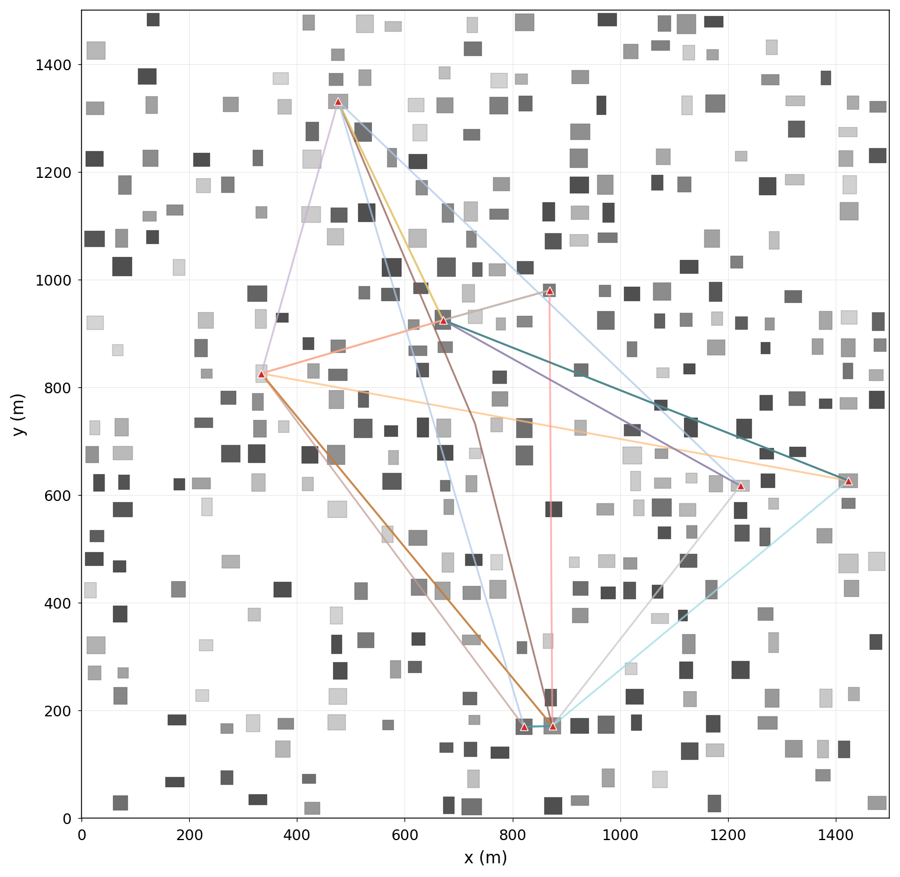
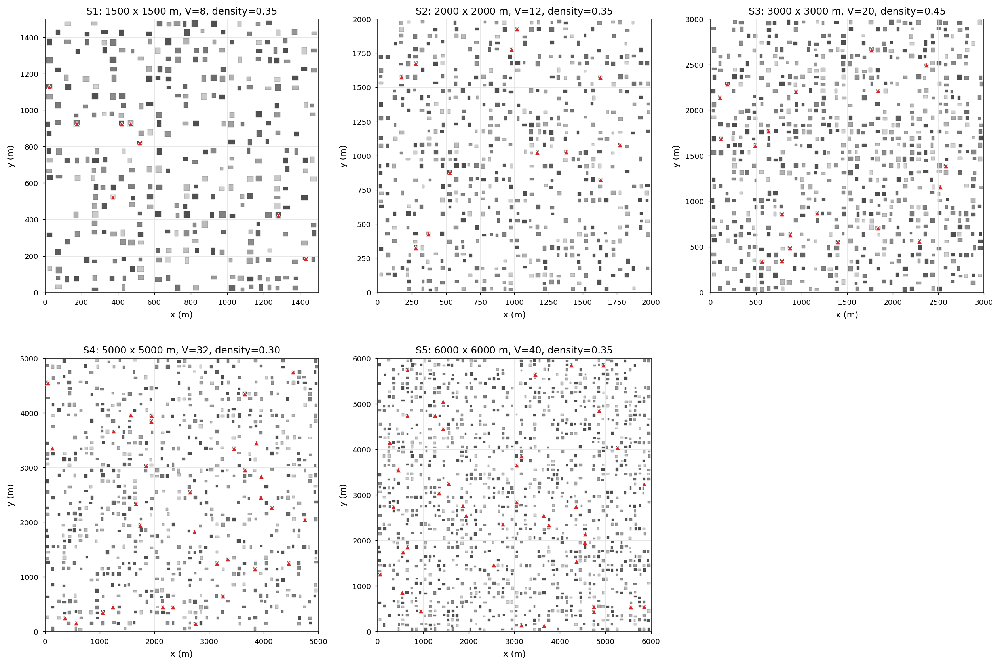
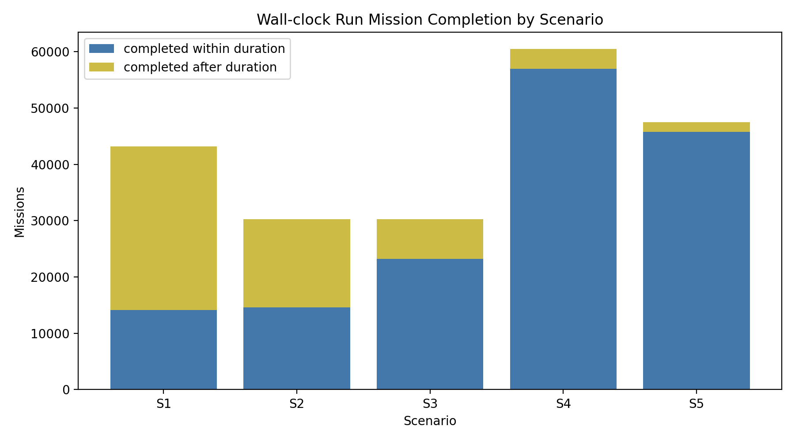
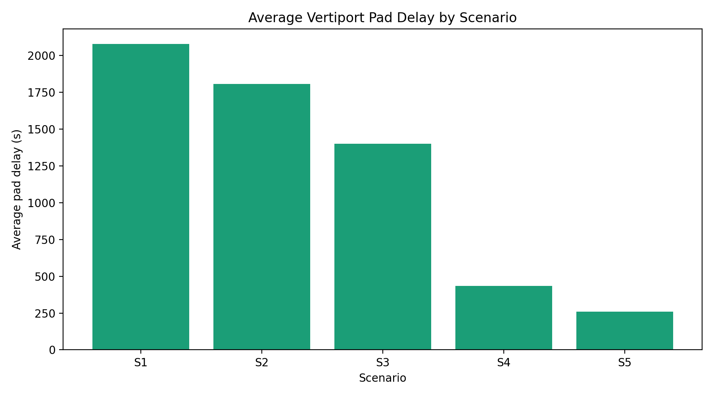
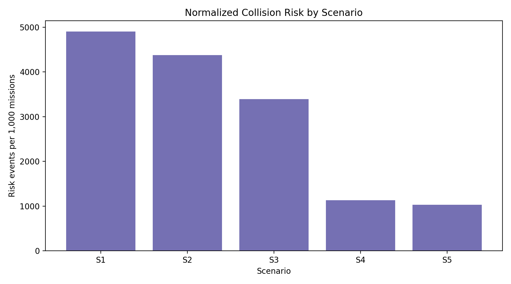
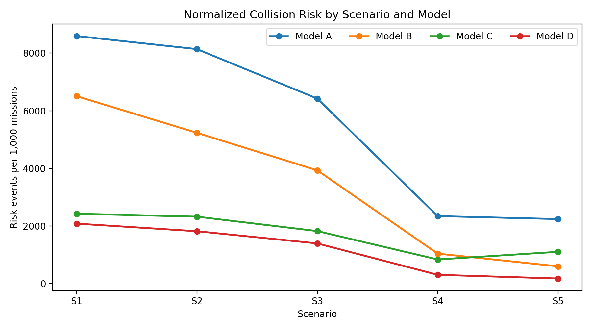

# Implementation of an eVTOL Mobility Model Simulator and Collision Avoidance Performance Analysis

## ABSTRACT
This study implements a lightweight Python-based eVTOL mobility model simulator for an urban grid environment and evaluates the relative effects of building avoidance, inter-aircraft collision avoidance, and vertiport pad occupancy. The simulator generates two-dimensional grid cities with three-dimensional building heights, assigns rooftop vertiports, creates continuous origin-destination missions, and models takeoff, climb, cruise, avoidance, landing wait, descent, and landing phases. Four ablation-style experimental conditions are defined by selectively applying building avoidance and inter-aircraft avoidance. A one-hour wall-clock experiment was conducted for five expanded scenarios, S1-S5, while each simulation run generated missions every 10 s over a 10,800 s simulated duration. The experimental dataset consists of 196 runs and 211,680 generated missions. The integrated avoidance condition showed 75.8-92.1% fewer collision-risk events per 1,000 generated missions than the no-avoidance condition, but residual risk events and vertiport pad delays remained. The result indicates that the proposed simulator can be used to separate the effects of avoidance functions and vertiport congestion under the experimental conditions defined in this study.

Keywords: eVTOL, Urban Air Mobility, Mobility Model, Simulation, Collision Avoidance, K-UAM

# eVTOL 이동성 모델 시뮬레이터 구현 및 충돌 회피 성능 분석

## 요약
본 연구는 도심 격자 환경에서 eVTOL 이동성 모델을 단순화하여 구현한 Python 기반 경량 시뮬레이터를 제안하고, 건물 회피, 비행체 간 충돌 회피, 버티포트 패드 점유 제약의 상대적 효과를 분석한다. 시뮬레이터는 2차원 격자 도시와 3차원 건물 높이를 생성하고, 건물 옥상 버티포트를 출발지와 목적지로 설정하며, 이륙, 상승, 순항, 회피, 착륙 대기, 하강, 착륙 단계를 모델링한다. 실험 조건은 건물 회피와 비행체 간 회피 기능의 적용 여부를 조합한 기능 제거 실험 형태로 구성하였다. 본 실험은 S1-S5의 다섯 확장 시나리오를 동시에 실행하는 1시간 wall-clock 방식으로 수행하였고, 각 run은 10,800 s의 가상 운항 시간 동안 10 s 간격으로 임무를 생성하였다. 실험 데이터는 총 196개 run과 211,680개 생성 임무로 구성된다. 정규화 지표 기준으로 통합 회피 조건은 회피 기능 미적용 조건 대비 1000개 임무당 충돌 위험 이벤트를 75.8-92.1% 낮췄으나, 일부 위험 이벤트와 버티포트 패드 지연은 남았다. 본 결과는 경량 eVTOL 이동성 모델 시뮬레이터를 통해 회피 기능과 버티포트 혼잡 효과를 분리해 관찰할 수 있음을 보이는 데 의의가 있다.

키워드: eVTOL, 도심항공교통, 이동성 모델, 시뮬레이션, 충돌 회피, K-UAM

## 1. 서론
도심항공교통(Urban Air Mobility, UAM)은 도심 내 3차원 공중교통체계를 활용하여 사람과 화물을 운송하는 항공교통 생태계로 제시되고 있다[1]. eVTOL은 수직이착륙과 전기추진을 기반으로 도심 내 짧은 이동시간을 제공할 수 있는 기체로 주목받고 있으나, 실제 도심 환경에서 운항하기 위해서는 건물, 항로, 버티포트, 기상, 통신, 교통관리, 충돌 회피가 함께 고려되어야 한다[1], [13].

K-UAM 기술로드맵은 UAM 운용고도를 300-600 m로 제시하고, UAM 교통관리서비스 제공자(PSU)가 항로 모니터링, 항공기간 분리관리, 버티포트 가용성, 악기상 정보 등을 다루는 구조를 설명한다[1]. 이는 eVTOL 이동성 모델을 단순한 출발지-목적지 연결 문제가 아니라, 도심 건물과 다중 기체 간 시공간 충돌 가능성을 포함한 문제로 다뤄야 함을 의미한다.

본 연구의 목적은 고충실도 항공기 동역학 또는 실제 UAM 운항 전 과정을 재현하는 데 있지 않고, 도심 격자 환경에서 건물 회피, 비행체 간 충돌 회피, 버티포트 패드 점유 제약이 장시간 누적 운항 지표에 미치는 영향을 분석할 수 있는 재현 가능한 시뮬레이션 프레임워크를 제안하는 데 있다. 본 연구의 기여점은 다음과 같다. 첫째, 격자형 도시 환경과 랜덤 건물 배치를 반영한 Python 기반 eVTOL 시뮬레이션 프레임워크를 구현하였다. 둘째, 건물 회피와 비행체 간 충돌 회피의 적용 여부를 조합한 기능 제거 기반 실험 조건을 구성하였다. 셋째, S1-S5 확장 도시 시나리오를 실제 약 1시간 동안 병렬 실행하여 장시간 누적 임무, 충돌 위험 이벤트, 버티포트 패드 지연을 표와 그래프로 분석하였다.

## 2. 관련 연구
Pang 등[3]은 다수 UAV의 4D 경로 충돌을 사전 탐지하고, 출발 지연, 속도 조정, 경로 재계획을 통해 충돌을 해소하는 적응형 최적화 프레임워크를 제안하였다. 이 연구는 6 km × 6 km × 120 m 공역과 100 m × 100 m × 30 m AirMatrix 블록을 사용하고, 최소 시간 분리 기준 30 s를 적용하였다. 본 연구는 해당 연구에서 제시한 다중 기체 경로 충돌과 시간 분리 개념을 단순 스케줄링 모델로 축소하여 반영하였다.

박재병[4]은 다중 UAV를 구로 모델링하고, 직선 경로와 일정 속도 조건에서 우선순위 기반 지연을 통해 충돌 없는 비행 계획을 생성하였다. 본 연구는 이 접근을 참고하여 먼저 출발한 기체, 목적지까지 남은 거리가 짧은 기체, ID가 낮은 기체를 우선하는 단순 우선순위 규칙을 사용하였다.

Yang과 Wei[5]는 UAM 자유비행 환경에서 MDP와 MCTS를 이용한 온보드 충돌 회피 방법을 제안하고, NMAC 기준 500 ft를 사용하였다. 본 연구는 이 기준을 기본 안전거리 조건으로 적용하였다. Panchal 등[6]은 UAM-CAS를 BlueSky 시뮬레이터에 구현하고 CPA, 지연시간, 회피기동을 평가 지표로 사용하였다. 본 연구 역시 충돌 횟수 외에 평균 지연시간, 평균 이동거리, 우회거리 등을 함께 산출하였다.

도심 장애물 회피와 관련하여 Zhang 등[7]은 1000 m × 1000 m × 50 m 도시 환경에서 다중 UAV의 건물 및 UAV 충돌 회피를 평가하였다. Moon[8]은 장애물을 넘어가는 경로와 우회하는 경로를 비교하여 더 짧은 경로를 선택하는 이중경로 방법을 제안하였다. Bilgin 등[9]은 panel method 기반 유도 기법으로 도심 장애물 주변 경로 생성을 실험하였다. 본 연구는 이들 연구를 참고하되, 복잡한 최적화나 강화학습 대신 격자형 도시와 waypoint 기반 우회 및 고도 레이어 변경을 사용하였다.

기상과 통신은 실제 UAM 운항에서 중요한 요소이다[12], [13]. 다만 본 연구의 구현 범위는 도시 격자 맵, 건물 회피, 비행체 간 충돌 회피, 버티포트 패드 점유 모델에 한정하였다. 기상 조건, 풍속, 시정 변화 등은 향후 확장 연구에서 반영할 필요가 있다.

## 3. 시뮬레이터 설계
### 3.1 전체 구조
시뮬레이터는 Python 기반의 모듈형 구조로 구현하였다. 주요 구성 요소는 설정 관리, 도시 맵 생성, 건물 및 버티포트 모델, 항공기 임무 생성, 경로계획, 충돌 위험 탐지, 회피 및 스케줄링, 결과 분석 모듈로 구성된다. 주요 입력 변수는 실험 조건표에 명시하여 동일한 조건에서 반복 실행할 수 있도록 하였다.

### 3.2 도시 격자 맵과 건물 모델
도시는 격자형 영역으로 설정하였다. 기본 구현은 Zhang 등[7]의 1000 m × 1000 m 도심 UAV 회피 실험 사례를 참고하였고, 확장 실험에서는 S1-S5의 1500-6000 m 규모 맵을 실험 조건으로 구성하였다. 격자 크기, 도로 폭, 건물 높이 30-300 m, 건물 밀도는 실험 반복 가능성을 위해 조건표에 명시하였다. 각 건물은 직사각형 footprint와 높이를 갖는 직육면체로 모델링하였다.

### 3.3 버티포트와 출발지·목적지
버티포트는 건물 옥상에 배치하였다. 버티포트 수는 K-UAM 수도권 네트워크 연구의 단계별 구조를 참고하여 기본 실험에서는 4/8/20개 구조를 사용하였고[2], S1-S5 확장 실험에서는 맵 규모 증가에 맞춰 8/12/20/32/40개로 설정하였다. 각 eVTOL은 서로 다른 두 버티포트를 무작위로 선택하여 출발지와 목적지로 사용한다. 또한 버티포트당 1개의 패드를 가정하여, 동일 버티포트에서 이륙 또는 착륙이 진행 중이면 후속 eVTOL은 다음 사용 가능 시점까지 대기하도록 하였다. 이륙 패드 점유시간은 30 s, 착륙 패드 점유시간은 수직 통제고도 50 m와 turnaround 180 s를 반영하여 190 s로 설정하였다.

### 3.4 이동성 모델
각 eVTOL은 대기, 상승, 순항, 하강, 착륙의 단계를 가진다. 순항고도는 K-UAM 기술로드맵의 300-600 m 범위 내에서 선택하며, 기본 고도는 300 m이다[1]. 속도는 150/240/300 km/h를 사용하고 내부 계산에서는 각각 41.667/66.667/83.333 m/s로 변환하였다. 수직속도는 5 m/s, 고도 레이어 간격은 50 m로 설정하여 상승·하강 및 고도 변경 과정을 단순화하였다.

### 3.5 건물 회피 모델
건물 회피는 직선 경로가 건물 footprint와 교차하고, 건물 높이에 안전 여유고도 30 m를 더한 값이 순항고도 이상일 때 충돌 위험으로 판정한다. 건물 회피가 활성화된 모델은 고도 레이어를 변경하거나, 필요 시 waypoint를 추가하여 우회한다.

### 3.6 비행체 간 충돌 회피 모델
비행체 간 충돌은 동일 시간대에서 두 기체의 수평거리가 안전거리보다 작고 수직거리가 고도 분리 기준보다 작을 때 발생한 것으로 판정하였다. 기본 안전거리는 500 ft, 즉 약 152.4 m이다[5]. 비행체 회피가 활성화된 모델은 출발 지연과 고도 레이어 변경을 통해 충돌을 줄인다.

## 4. 실험 설계

### 4.1 기능 조합 조건
| 모델 | 설명 |
|---|---|
| Model A | 회피 기능 미적용 조건 |
| Model B | 건물 회피 기능만 적용한 조건 |
| Model C | 비행체 간 회피 기능만 적용한 조건 |
| Model D | 건물 회피와 비행체 간 회피 기능을 함께 적용한 조건 |

### 4.2 실험 시나리오
공식 실험은 S1-S5의 다섯 확장 도시 시나리오를 동시에 실행하는 wall-clock 방식으로 구성하였다. 각 시나리오 프로세스는 실제 경과 시간이 약 1시간에 도달할 때까지 Model A-D를 반복 실행하였고, 각 run은 10,800 s의 가상 운항 시간 동안 10 s 간격으로 새 임무를 생성하였다. 생성된 임무는 사용 가능한 기체에 배정하고, 착륙 완료 후에는 동일 기체를 재투입하였다. 속도는 240 km/h, 기본 안전거리는 500 ft로 설정하였다.

| 시나리오 | 맵 크기 | 격자 | 건물 밀도 | 버티포트 | fleet size | 공식 run 수 | 생성 임무 |
|---|---:|---:|---:|---:|---:|---:|---:|
| S1 | 1500 m × 1500 m | 50 m | 0.35 | 8 | 75 | 40 | 43,200 |
| S2 | 2000 m × 2000 m | 50 m | 0.35 | 12 | 100 | 28 | 30,240 |
| S3 | 3000 m × 3000 m | 75 m | 0.45 | 20 | 150 | 28 | 30,240 |
| S4 | 5000 m × 5000 m | 100 m | 0.30 | 32 | 200 | 56 | 60,480 |
| S5 | 6000 m × 6000 m | 100 m | 0.35 | 40 | 300 | 44 | 47,520 |

### 4.3 출력 지표
주요 출력 지표는 총 비행 횟수, 성공 비행 횟수, 실패 비행 횟수, 건물 충돌 위험 이벤트, 비행체 간 충돌 위험 이벤트, 총 충돌 위험 이벤트, 평균 비행 거리, 평균 비행 시간, 평균 지연 시간, 평균 우회 거리, 평균 고도 변경 횟수, 평균 경로 변경 횟수, 평균 이륙 패드 대기시간, 평균 착륙 패드 대기시간, 평균 총 패드 대기시간이다. 각 실험 조건의 결과는 성능 지표와 비교 그래프로 정리하여 회피 기능과 버티포트 혼잡의 영향을 분석하였다.

## 5. 실험 결과
### 5.1 wall-clock 실행 규모
공식 실험 데이터는 S1-S5를 동시에 시작한 뒤 각 시나리오 프로세스가 약 1시간 동안 Model A-D 조건을 반복 실행하는 방식으로 산출하였다. 전체 run 수는 196개이며, 생성 임무 수는 211,680개이다. 패드 점유 구간을 검증한 결과 동일 시나리오·버티포트·패드 내 점유 구간 겹침은 0건이었다.

| 시나리오 | run 수 | 실행시간(min) | 생성 임무 | duration 내 완료 | 완료율(%) | 총 위험 이벤트 | 위험/1000임무 | 평균패드지연(s) |
|---|---:|---:|---:|---:|---:|---:|---:|---:|
| S1 | 40 | 60.1 | 43,200 | 14,133 | 32.7 | 211,754 | 4,901.7 | 2,077.1 |
| S2 | 28 | 61.5 | 30,240 | 14,589 | 48.2 | 132,418 | 4,378.9 | 1,805.2 |
| S3 | 28 | 65.2 | 30,240 | 23,223 | 76.8 | 102,613 | 3,393.3 | 1,399.4 |
| S4 | 56 | 60.7 | 60,480 | 56,945 | 94.2 | 68,427 | 1,131.4 | 435.3 |
| S5 | 44 | 60.6 | 47,520 | 45,760 | 96.3 | 48,946 | 1,030.0 | 258.9 |

### 5.2 시나리오 규모와 혼잡 효과
S1-S3는 상대적으로 작은 맵 규모와 제한된 버티포트 수에 비해 임무 투입률이 높아 평균 패드 지연이 크게 나타났다. 특히 S1은 평균 패드 지연이 2,077.1 s이고 duration 내 완료율이 32.7%에 그쳤다. 반면 S4와 S5는 맵 규모와 버티포트 수가 증가하면서 duration 내 완료율이 각각 94.2%, 96.3%로 상승하였고, 평균 패드 지연은 각각 435.3 s와 258.9 s로 낮아졌다. 이는 버티포트 패드 용량과 공간적 분산이 장시간 누적 운항에서 중요한 병목 요인임을 보여준다.

### 5.3 충돌 위험 이벤트
본 연구에서 `collision_risk_count`는 실제 사고 횟수가 아니라 시간 샘플 기반 충돌 위험 이벤트 수이다. 시나리오별 총 위험 이벤트는 S1 211,754건, S2 132,418건, S3 102,613건, S4 68,427건, S5 48,946건으로 나타났다. 생성 임무 수가 시나리오마다 다르므로, 비교에는 1000개 생성 임무당 위험 이벤트 수를 함께 사용하였다. 이 정규화 지표는 S1 4,901.7, S2 4,378.9, S3 3,393.3, S4 1,131.4, S5 1,030.0으로, 큰 맵과 많은 버티포트가 적용된 S4-S5에서 낮게 나타났다.

### 5.4 회피 기능별 영향 분석
기능 조합 조건별 결과는 각 회피 기능이 어떤 위험 유형에 영향을 주는지 보여준다. 건물 회피 기능만 적용한 Model B는 건물 위험 이벤트를 제거하는 데 효과적이었지만 기체 간 위험 이벤트는 남았다. 비행체 간 회피 기능만 적용한 Model C는 기체 간 위험 이벤트를 줄였지만 건물 위험 이벤트가 남았다. 두 기능을 함께 적용한 Model D는 Model A보다 낮은 정규화 충돌 위험을 보였으나, 위험 이벤트를 완전히 제거하지는 못했다. 따라서 본 결과는 통합 조건의 우월성 자체보다, 회피 기능과 버티포트 병목이 서로 다른 성능 지표에 미치는 영향을 분리해 보여주는 기능 제거 실험으로 해석하는 것이 적절하다.

| 시나리오 | Model A | Model B | Model C | Model D | D의 A 대비 위험 감소율(%) |
|---|---:|---:|---:|---:|---:|
| S1 | 8,593.4 | 6,506.5 | 2,424.8 | 2,082.1 | 75.8 |
| S2 | 8,140.1 | 5,234.0 | 2,324.1 | 1,817.5 | 77.7 |
| S3 | 6,422.5 | 3,932.7 | 1,822.4 | 1,395.6 | 78.3 |
| S4 | 2,342.9 | 1,040.3 | 837.2 | 305.1 | 87.0 |
| S5 | 2,240.6 | 599.6 | 1,103.5 | 176.3 | 92.1 |

### 5.5 결과 해석
장시간 누적 운항 결과에서 회피 알고리즘의 효과와 버티포트 혼잡 효과가 동시에 관측되었다. 회피 알고리즘은 충돌 위험 이벤트를 낮췄지만, 버티포트당 패드 1개 조건에서는 이착륙 대기와 기체 재투입 지연이 누적되었다. 따라서 eVTOL 이동성 모델을 평가할 때 단순한 경로 충돌뿐 아니라 버티포트 자원 점유, 임무 생성 간격, fleet size, 맵 규모를 함께 고려해야 한다.

## 6. 결론
본 연구는 도심 격자 환경에서 건물과 다중 eVTOL 간의 시공간적 충돌 가능성 및 버티포트 패드 점유 제약을 고려한 경량 Python 기반 eVTOL 이동성 모델 시뮬레이터를 구현하였다. 장시간 누적 실험은 S1-S5 다섯 시나리오에서 총 196개 run과 211,680개 생성 임무를 산출하였다. 기능 제거 기반 비교 결과, 건물 회피 기능은 건물 위험 이벤트를 줄이는 데 직접적으로 작용하고, 비행체 간 회피 기능은 기체 간 위험 이벤트를 줄이는 데 기여하였다. 두 기능을 함께 적용한 조건에서도 일부 위험 이벤트와 패드 지연은 남았으며, 특히 S1-S3에서는 패드 지연과 설정된 가상 운항 시간 이후 완료 임무가 크게 증가하여 버티포트 자원 제약이 장시간 누적 운항의 주요 병목으로 작용함을 확인하였다.

본 연구는 지도 기반 충돌 위험 판정과 단순화된 비행 단계 모델을 사용하므로, 결과 해석은 제안한 실험 환경과 입력 조건의 범위 안에서 이루어져야 한다. 충돌 위험 이벤트는 실제 사고 횟수가 아니라 시간 샘플 기반 위험 판정 횟수이며, 버티포트 패드 점유는 버티포트당 패드 1개 조건에 기반한다. 향후 연구에서는 실제 도시 건물 데이터, 고해상도 기상자료, 통신 지연, 센서 오차, 정교한 4D trajectory 기반 교통관리, 에너지 소비 모델을 반영할 필요가 있다. 또한 패드 수와 turnaround time 변화, 수요 패턴 변화, 안전거리 민감도 분석을 S1-S5 확장 시나리오에 추가하여 통계적 신뢰도를 높여야 한다.

## References
[1] 관계부처 합동, “한국형 도심항공교통(K-UAM) 기술로드맵,” 2021. 발행기관 및 발행연도 최종 원문 대조 필요.

[2] 정인회, 손봉수, “한국형 도심항공교통(K-UAM) 수도권 네트워크 구축에 관한 연구,” 대한교통학회지, 제43권, 제5호, 2025.

[3] B. Pang, K. H. Low, and C. Lv, “Adaptive conflict resolution for multi-UAV 4D routes optimization using stochastic fractal search algorithm,” Transportation Research Part C, vol. 139, 103666, 2022.

[4] 박재병, “다중 무인 항공기의 협동 작업을 위한 무 충돌 비행 계획,” 전자공학회논문지 SC편, 제49권, 제2호, 2012.

[5] X. Yang and P. Wei, “Autonomous Free Flight Operations in Urban Air Mobility With Computational Guidance and Collision Avoidance,” IEEE Transactions on Intelligent Transportation Systems, vol. 22, no. 9, 2021.

[6] I. Panchal, S. F. Armanini, and I. C. Metz, “Evaluation of collision detection and avoidance methods for urban air mobility through simulation,” CEAS Aeronautical Journal, vol. 16, pp. 905-920, 2025.

[7] J. Zhang et al., “Adaptive Collision Avoidance for Multiple UAVs in Urban Environments,” Drones, vol. 7, 491, 2023.

[8] S. Moon, “A Dual-path Adaptive Selection Method for Unmanned Aerial Vehicles,” Journal of The Korea Society of Computer and Information, vol. 30, no. 10, pp. 155-162, 2025.

[9] Z. Bilgin, I. Yavrucuk, and M. Bronz, “Urban Air Mobility Guidance with Panel Method: Experimental Evaluation Under Wind Disturbances,” Journal of Guidance, Control, and Dynamics, vol. 47, no. 6, pp. 1080-1096, 2024.

[10] S. Tian et al., “Fast UAV path planning in urban environments based on three-step experience buffer sampling DDPG,” Digital Communications and Networks, vol. 10, pp. 813-826, 2024.

[11] G. Zheng, P. Li, and D. Wu, “An Obstacle Avoidance Trajectory Planning Methodology Based on Energy Minimization for the Tilt-Wing eVTOL in the Takeoff Phase,” World Electric Vehicle Journal, vol. 15, 300, 2024.

[12] 김은지, 성진규, 이강민, 김휘양, “기상 제약조건을 고려한 계절별 UAM 경로 선정 연구: 대한민국 제주 관광노선을 중심으로,” 대한교통학회지, 제42권, 제2호, pp. 125-138, 2024.

[13] M. Y. Arafat and S. Pan, “Urban Air Mobility Communications and Networking: Recent Advances, Techniques, and Challenges,” Drones, vol. 8, 702, 2024.

[14] S. Ghambari, M. Golabi, L. Jourdan, J. Lepagnot, and L. Idoumghar, “UAV path planning techniques: a survey,” RAIRO Operations Research, vol. 58, no. 4, pp. 2951-2989, 2024.

[15] 조시훈, 김태영, “카메라 기반 강화학습을 이용한 드론 장애물 회피 알고리즘,” 한국컴퓨터그래픽스학회논문지, 제27권, 제5호, pp. 63-71, 2021.
